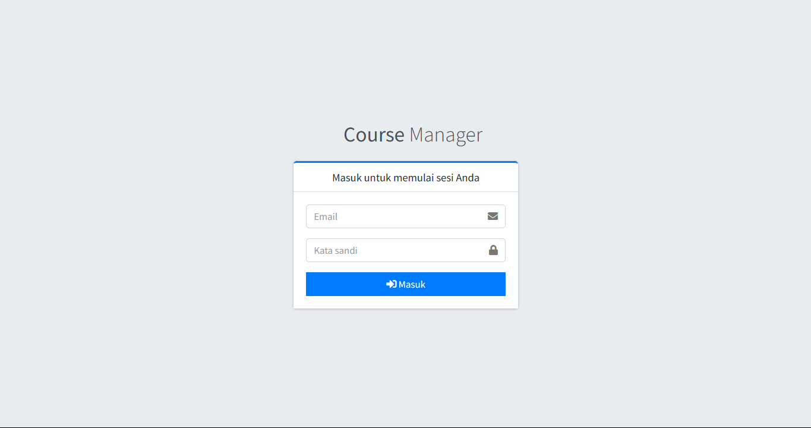
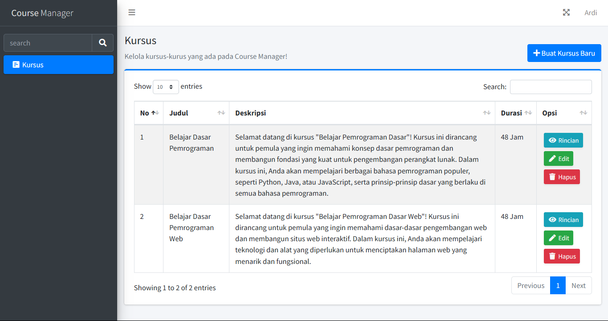
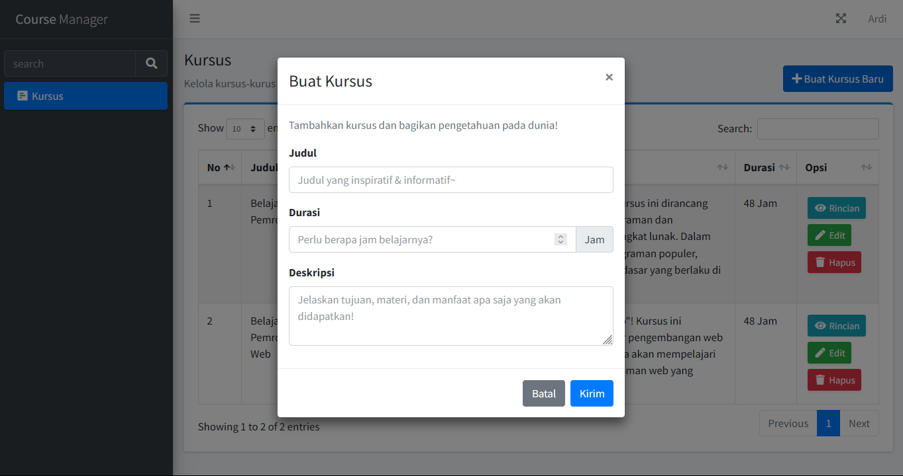
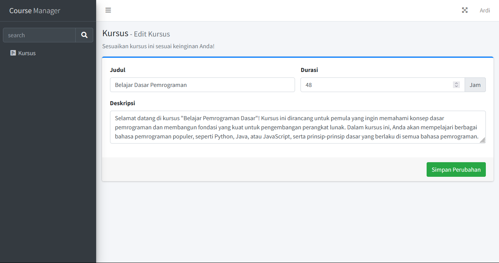
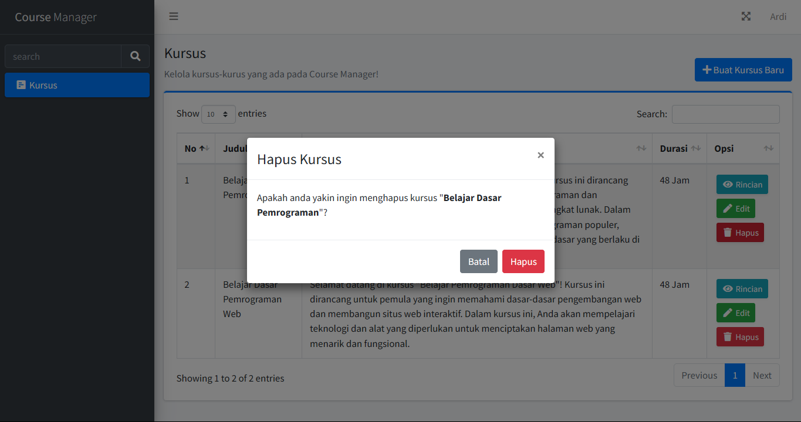
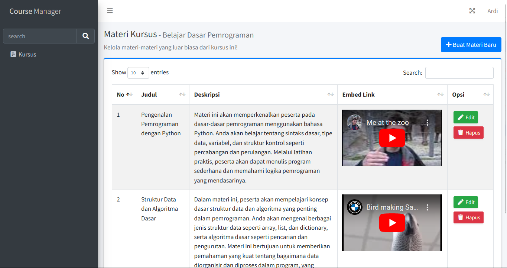
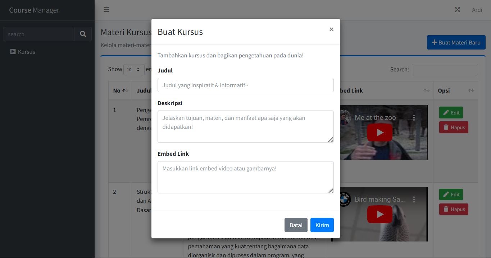
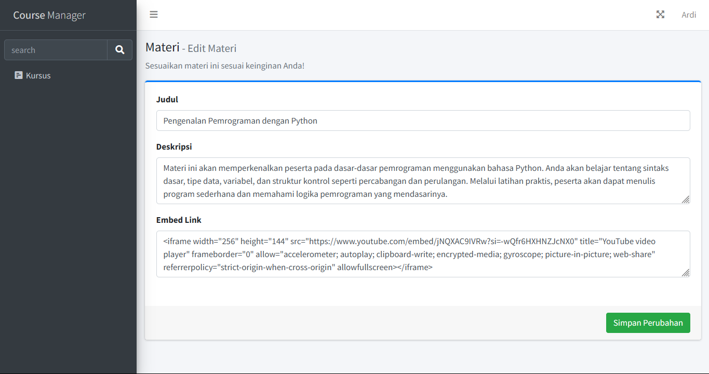
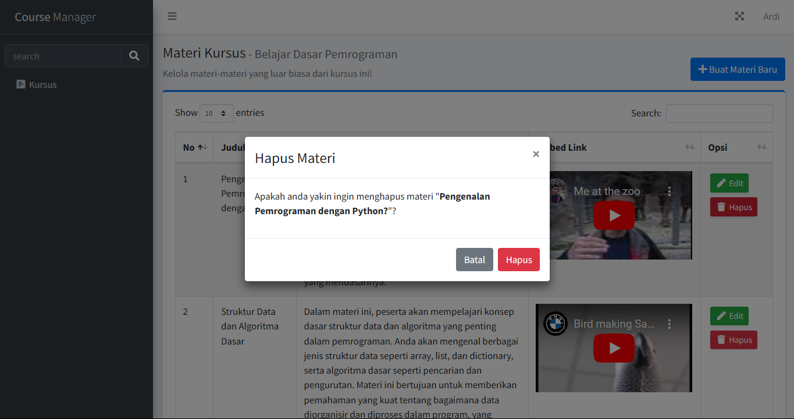

This is a repository made for fulfilling "MSIB 7 - Yayasan Hasnur Centre - Web Developer - Digitaliz" selection test.

[Laravel](https://laravel.com/) 11 & [LAMP stack](https://en.wikipedia.org/wiki/LAMP_(software_bundle)) is used for making this project.

## Requirements
- [PHP](https://www.php.net/) >= 8.2
- Webserver of choice *([Apache](https://apache.org) 2.4 used during development)*
- Database of choice *([MySQL](https://www.mysql.com/) 8.0 used during development)*
- [Composer](https://getcomposer.org) >= 2.0

## Installation

1. Clone this repository
    ```
    git clone https://github.com/azhimn/yhc-webdev-test.git
    ```

2. Initialize the project
    ```
    cd yhc-webdev-test
    composer install 
    ```

3. Configure your environment

    Configure .env file to fit your environment. Use text editor of your choice *([vim](https://www.vim.org) is used here)* to edit environment variables such as database     information, app environment, and its base URL.
    ```
    cp .env.example .env
    vim .env
    ```

5. Run the migrations
    ```
    php artisan migrate --seed
    ```

6. Run the app
    ```
    php artisan serve
    ```

## User Login
You can login by using the following credentials.

Email
```
ardi@mail.com
```
Password
```
password
```

## Screenshots
#### Login Page

#### Course Pages




#### Material Pages




